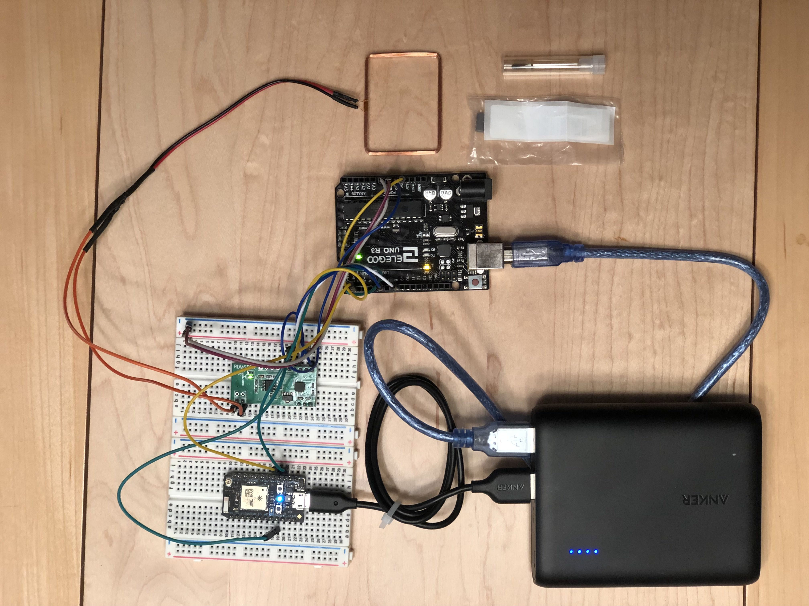
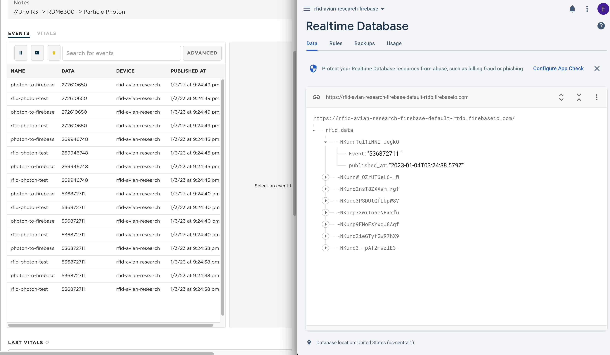

# Arduino RFID Project - Prototype for Animal Model Research

This project demonstrates an **Arduino-based RFID reader** designed to monitor the activity of captive animals (e.g., mice, finches) in research settings. The system enables researchers to quantify how often each animal enters specific areas of an enclosure (e.g., near a food or water dispenser) without relying on time-intensive video reviews. 

By leveraging **readily available components**, this solution is cost-effective, scalable, and accessible to researchers. Additionally, multiple systems can be connected to a **real-time Firebase database** via webhooks for seamless data aggregation.

---

## What is RFID?

**Radio Frequency Identification (RFID)** is a technology that uses electromagnetic fields to identify and track objects, animals, or individuals through small, encoded tags. An **RFID system** typically consists of three components:
- **RFID tags**: Contain unique identification information.
- **RFID readers**: Detect and read data from the tags via electromagnetic waves.
- **Backend system**: Processes and stores the collected data.

RFID systems are widely used for **access control, inventory management, and tracking**, making them ideal for monitoring animal activity in research settings.

---

### **Use Case: Monitoring Research Animals**
In the context of animal model research, RFID systems can:
- **Track eating and drinking behavior**: Identify when and how often a specific animal visits a food or water dispenser.
- **Monitor movement patterns**: Detect activity levels and time spent in different areas of the enclosure.
- **Reduce manual labor**: Automate data collection and eliminate the need for manual video reviews.
- **Improve accuracy**: Enable precise, real-time data collection for behavioral studies.

Using RFID for research animals is non-invasive and scalable, making it ideal for studies requiring long-term behavioral monitoring.

---

## System Overview

The system tracks unique RFID tags as animal move within their enclosure. When a tag passes over the **RFID reader's copper coil**, the data is sent via Wi-Fi to a **cloud database** using the Particle Photon. Duplicate reads are filtered during data processing to ensure accuracy.  

### **System in Action**
Below is a GIF showing the system at work:  

---

## Components

This project integrates the following core components:  

- **Arduino Uno R3**: The main development board for processing RFID signals.  
- **RDM6300 RFID Reader**: Reads RFID tags and communicates with the Arduino.  
- **Particle Photon**: Handles Wi-Fi connectivity and data transmission to Firebase.

### **Arduino Uno R3**
The Arduino Uno R3 is a versatile microcontroller board ideal for electronic prototyping. It offers:  
- **Digital and analog I/O pins** for integrating sensors and devices.  
- **Beginner-friendly programming** using the Arduino IDE.  
- Robust community support for troubleshooting and extensions.

### **RDM6300 RFID Reader**
The RDM6300 is a compact 125 kHz RFID reader designed for:  
- Reading RFID tags through a **serial interface**.  
- Use cases such as access control, inventory management, and asset tracking.

### **Particle Photon**
The Particle Photon is a Wi-Fi-enabled IoT development board that provides:  
- Real-time **cloud connectivity**.  
- Support for IoT applications like sensor data collection and device communication.  
- A **secure infrastructure** for remote device management.

---

## Code Overview

This project includes two main components: the Arduino (`arduino_r3.ino`) and the Particle Photon (`particle_photon.ino`). Both work together to process RFID data and publish it to the cloud.

### **Arduino Code (`arduino_r3.ino`)**
The Arduino code handles RFID tag reading and checksum validation before transmitting the data to the Particle Photon.  
**Key Functionalities**:
- **RFID Data Reading**:
  - Reads tag data from the RDM6300 RFID reader using a software serial interface.
  - Buffers and processes tag data upon transmission completion.
- **Checksum Validation**:
  - Verifies data accuracy by calculating and comparing a checksum.
- **Data Transmission**:
  - Sends validated tag data to the Particle Photon via a designated pin.

**Code Structure**:
- **Setup Function**:
  - Initializes serial communication with the RFID reader and Particle Photon.
- **Loop Function**:
  - Continuously reads data from the RFID reader, processes it, and validates its checksum.
- **Helper Functions**:
  - `extract_tag()`: Extracts tag information and checks its validity.
  - `hexstr_to_long()`: Converts hexadecimal strings to numeric values for validation.

---

### **Particle Photon Code (`particle_photon.ino`)**
The Particle Photon code receives the tag data from the Arduino and publishes it to the cloud via the Particle Cloud platform.

**Key Functionalities**:
- **Data Reception**:
  - Reads data from the Arduino through the Serial1 interface.
- **Data Processing**:
  - Buffers the received data and triggers processing once a complete message (ending with a newline) is received.
- **Cloud Publishing**:
  - Publishes the processed RFID tag data to the Particle Cloud for further analysis or storage.

**Code Structure**:
- **Setup Function**:
  - Initializes serial communication with the Arduino and Particle Cloud.
- **Loop Function**:
  - Continuously listens for data from the Arduino, buffers it, and calls `processBuffer()` when a complete message is received.
- **Helper Functions**:
  - `processBuffer()`: Publishes the received tag data to the Particle Cloud.

---

## Completed Setup

Here’s the final hardware configuration. Note that the Arduino R3 and Particle Photon can be powered either via onboard USB or through their **5V pins**.  

---

## Firebase Integration

Data is sent to a **real-time Firebase NoSQL database** using a webhook. Firebase simplifies backend development with features like:  

- **Real-time database**: Captures and syncs data across devices.  
- **Cloud Functions**: Serverless code execution triggered by database events or HTTP requests.  
- **Scalability**: Ideal for managing multiple systems concurrently.  

This ensures an efficient and streamlined method for researchers to access and analyze activity data.  

---

## Key Benefits

- **Scalability**: Easily deploy multiple systems across enclosures.  
- **Cost-effectiveness**: Leverages affordable, off-the-shelf components.  
- **Real-time insights**: Aggregates data in Firebase for immediate analysis.  
- **Reduced labor**: Eliminates the need for video monitoring of animal activity.

---

## Future Scope

1. **Enhanced Accuracy**: Improve RFID reader precision to further reduce duplicate reads.  
2. **Advanced Analytics**: Implement additional data processing and visualization tools.  
3. **Integration with ML Models**: Use machine learning to identify behavioral patterns in real-time.  
4. **Broader Applications**: Adapt the system for other research or industrial use cases, such as warehouse inventory tracking.  

---

## License

This project is licensed under the MIT License. You can view the full license [here](https://github.com/IgorAntun/node-chat/blob/master/LICENSE).  